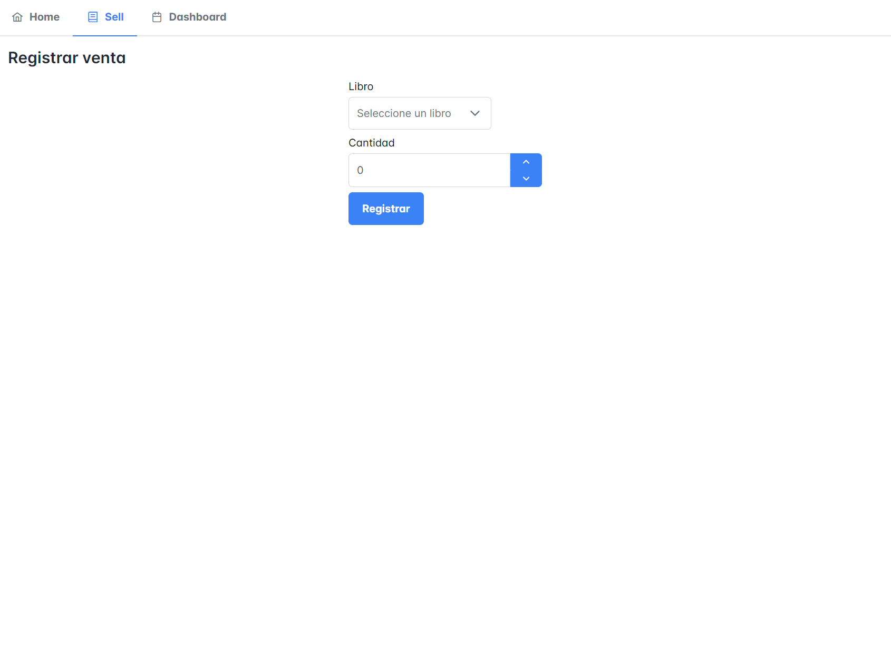

# DevU - Evaluación Técnica

Este repositorio contiene el proyecto DevU, desarrollado como parte de una evaluación técnica. La aplicación permite gestionar una lista de libros y registrar ventas de los mismos.

La aplicación está desarrollada utilizando Firebase para el backend y Angular para el frontend.

## Recursos

### Video de Demostración

Para ver una demostración en video de la aplicación, haga clic en el siguiente enlace:

### Imágenes

#### Diagrama de la Base de Datos

#### Pantalla de Inicio

En esta pantalla se puede observar la lista de libros con su información.

#### Pantalla de Registro de Ventas

En esta pantalla se puede registrar la venta de libros.

## Stack Tecnológico

- **Backend**: Firebase (Firestore)
- **Frontend**: Angular
- **Componentes de UI**: PrimeNG
- **Herramienta para el Diagrama**: PlantUML

